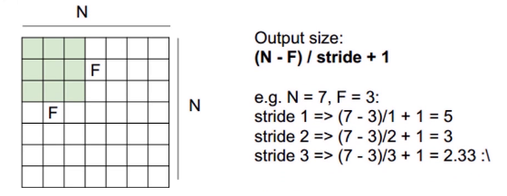
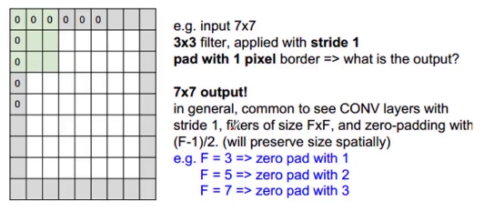

权值共享与局部连接

    1. 卷积运算作用在局部, 因此在这个区域是权值共享的, 而上一级节点与下一级节点的连接关系则称为局部连接, 若下一级节点与上一级的所有节点都有连接关系则称为全连接。
    2. Feature map使用同一个卷积核运算后得到一种特征。
    3. 多种特征采用多个卷积核(channel), 具体为多少个卷积核取决于num_out。
    

卷积的参数量以及计算量
    
    1. 参数量： (k_w*k_h*in_channel+1)*Out_Channel, 其中+1项由偏置操作产生。
    2. 计算量： in_w*in_h*(k_w*k_h*in_channel+1)*Out_Channel

防止过拟合的策略

    1. 正则化
    2. 早停DorpOut
    3. 增大数据集
    4. 减少参数量
    5. 增加BatchNorm层
    
步长stride, 不会影响卷积核的参数量, 但是会影响卷积计算的计算量

    1. 在pooling层下采样过程中会直接受stride参数影响
    2. 在同一个卷积核的情况下，stride设置不同计算所得的Feature Map也会不同
    3. stride越大计算量会小，一般设置为1或者2，设置为2时，长、宽下采样都会增大至2倍，整体下采样则增大至4倍
    
    Output size: (N-F)/stride+1
    e.g. N=7, F=3
    stride 1    =>  (7-3)/1 + 1 = 5
    stride 2    =>  (7-3)/2 + 1 = 3
    stride 3    =>  (7-3)/3 + 1 = 2.33

    
pad 确保Feature Map整数倍变化，对尺度相关的任务非常重要

    