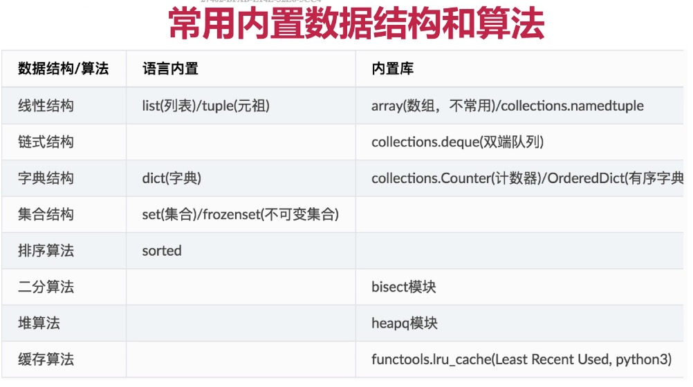

[内置数据结构文档](https://docs.python.org/3.6/library/collections.html?highlight=coll#module-collections)



### 常用内置数据结构
```python
import collections

# 具名元祖
Point = collections.namedtuple('Point', 'x, y')
p = Point(1, 2)
print(p.x)
print(p.y)
print(p[0])
print(p[1])

# 双端队列
de = collections.deque()
de.append(1)
de.appendleft(0)
print(de)
de.pop()
print(de)
de.append(22)
de.popleft()
print(de)

# 计数器
c = collections.Counter('aabbccdeef')
print(c)
print(c.get('a'))
print(c.most_common()) # 从大到小的顺序来获取信息

# 按Key插入先后有序的OrderDict
od = collections.OrderedDict()
od['c'] = 'c'
od['a'] = 'a'
od['b'] = 'b'
print(od.keys())

# 带默认值的字典 
dd = collections.defaultdict()
dd['a']
dd['b'] += 1
print(dd)

# list和tuple
# 都是线性结构，支持下标访问
# list是可变对象, tuple保存的引用不可变
t = ([1], 2, 3)
try:
    t[2] = 33
except Exception as e:
    print(e)
t[0].append(11)
print(t)
# 保存的引用不可变指的是你没法替换掉这个对象，
# 但是如果被操作的子对象本身是一个可变对象，
# 这个引用所指向的可变对象是可以修改的

# list不能用作dict的key, 而tuple可以, 原因是可变对象不可hash

```

### Python Dict 底层结构
```python
# 底层使用哈希表，支持快速查找，平均复杂度为O(1), Cython解释器使用二次探查解决哈希冲突问题
# 常考哈希冲突和扩容

```

### LRUCache
```python
# 是一种缓存剔除策略，缓存剔除则是指当缓存空间不够用的时候需要一种方式剔除key
# 常见策略有LRU、LFU

# LRU通过使用一个循环双端队列不断把最新访问的key放在表头实现，这样最远使用的就在后面。
# 字典来做缓存，循环双端列表用来记录访问顺序
# 利用Python内置的dict、collections.OrderDict实现
# dict用来当作k/v键值对的缓存
# 使用OrderDict用来更新最近访问的key
from collections import OrderedDict


class LRUCache(object):
    
    def __init__(self, capacity=128):
        self.od = OrderedDict()
        self.capacity = capacity
    
    # 每次访问更新最新使用的key    
    def get(self, key):
        if key in self.od:
            val = self.od[key]
            self.od.move_to_end(key=key)
            return val
        else:
            return -1
    
    # 更新k/v
    def put(self, key, value):
        if key in self.od:
            del  self.od[key]
            self.od[key] = value    # 更新key到表头
        else:
            self.od[key] = value    # 直接将key插入表头
            # 判断当前容量是否已满
            if len(self.od) > self.capacity:
                # 删除最早的元素
                self.od.popitem(last=False)
```
