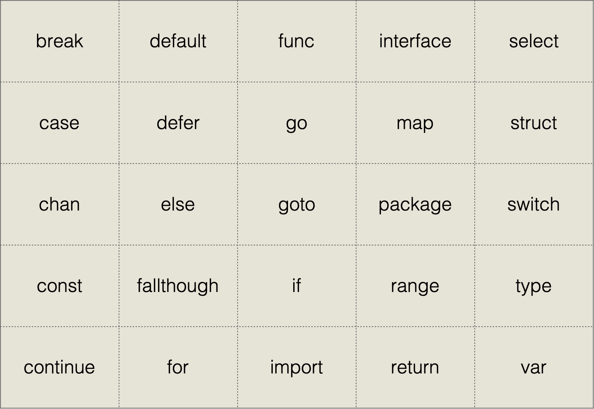

### Golang执行顺序

    初始化全局变量 -> init函数 -> main函数

### Golang类型推导
```go
var (

    a = 100
    b = "sb"
)
```

### iota自动计数
var (

    a   // 0
    b   // 1
    c   // 2
)

### 值类型与引用类型
- 值类型
    
    int、float、bool、string、array、struct
    变量直接存储值，内存通常在栈中分配

- 引用类型
    
    指针、slice、map、chan
    变量存储的是一个地址，这个地址存储最终的值，内存通常在堆上分配，通过GC回收
    
### Swap
```go

func Swap(a, b int) (int, int) {
	return b, a
}

func Swap2(a, b *int) {
	*a, *b = *b, *a
}

func main() {
	a, b := 50, 100
	fmt.Println(a, b)
	a, b = b , a
	fmt.Println(a, b)
	a, b = Swap(a, b)
	fmt.Println(a, b)
	a, b = Swap2(&a, &b)
	fmt.Println(a, b)
}
```

### 关键字
