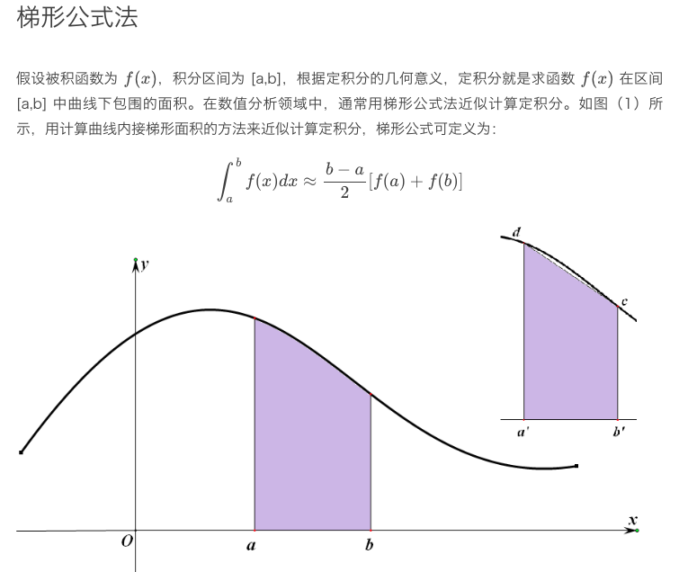
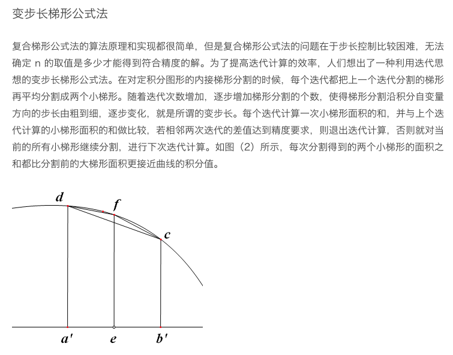
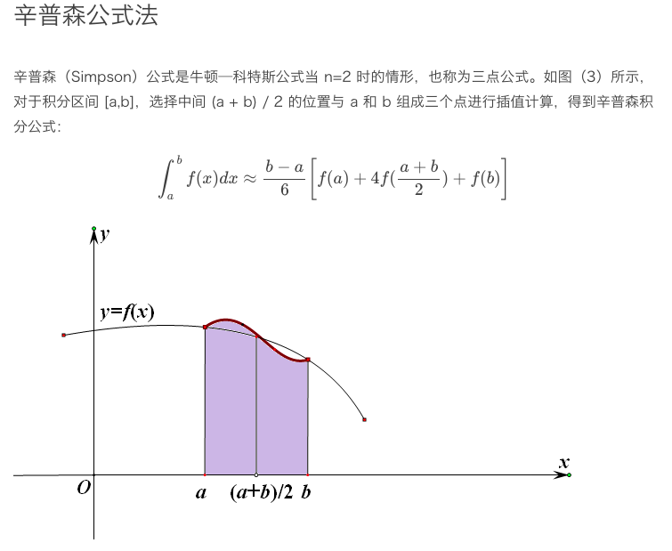

计算数值积分的两种常用方法
    
    变步长梯形公式法
    变步长辛普森公式法
    

可变长辛普森公式法
    
    和梯形公式一样，
    复合辛普森公式也可以改造为变步长辛普森公式法。
    改造的方法就是使用迭代法的思想，
    通过改变区间个数 n 使得步长 step 也跟着变化，
    当迭代差值符合精度要求时即可停止迭代。
    算法的迭代变量仍然是每次分割后的小区间上
    使用辛普森公式计算的插值曲线面积之和，
    迭代关系则非常简单，
    就是用本迭代的迭代变量代替上个迭代的迭代自变量的值，
    迭代终止条件就是两个迭代的迭代变量之差小于精度值。
    迭代变量的初始值就是在区间 [a,b] 上
    应用辛普森公式计算最大的区间面积。
    用一个变量 n 表示当前迭代分割小梯形的个数，
    n 的值每个迭代增加一倍。
    而每次分割后的小区间面积和的计算
    可由第 2-2 课中给出的
    复合辛普森公式算法 simpson() 函数计算，
    迭代算法的整体结构与变步长梯形法类似。

